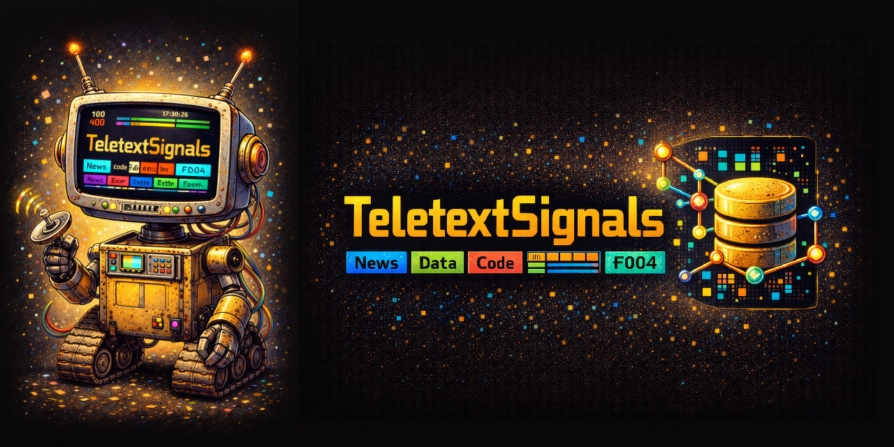
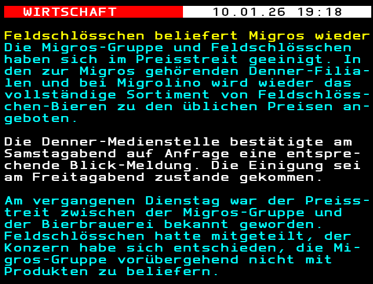

# TeletextSignals - Embeddings & RAG

## TLDR;
This is a proof of concept for a local RAG and LLM setup to query your documents. See the final examples [here](C_agentic_rag_example.ipynb) and [here](B_2step_rag_example.ipynb).

Swiss Teletext articles from the last 25 years are used as the example corpus.

Because this runs completely locally, none of your data (neither your queries nor your documents) leaves your device,
so this setup could be used to process confidential information.

## Intention
This repo is intended as a **working proof of concept (PoC)** for two things:

- a completely local RAG architecture to query a (relatively large) body of text documents on-device
- some experiments in extracting temporal news signals (*work in progress*)

### Text documents
Swiss news teletext articles in the German language are used as an underlying source. They are downloaded from [teletext.ch](https://www.teletext.ch/SRF1/100).
The archive reaches back 25 years and contains >500k entries, see [0_teletext_key_figures.ipynb](0_teletext_key_figures.ipynb) for details.

The advantage is that these are relatively short and on-point summaries of recent events.



## Retrieval-Augmented Generation (RAG)

### Document Preparation (Embedding and Vector Store)


Texts are chunked (*Note*: usually the texts are short enough to not require chunking, but
this step makes the workflow extendable for longer documents, e.g. from other sources).

Embedding transforms text into a point in a multidimensional vector space, with the intention
to cluster documents with a similar semantic meaning close together. We need to use a model that
is optimized for a) query retrieval, b) multilingual coverage, and c) works well with news articles.

Postgres with pgvector is used as vector database to efficiently store and query the vector space.

- Embedding Model: [`intfloat/multilingual-e5-large`](https://huggingface.co/intfloat/multilingual-e5-large)
  - Purpose:
      - High-recall semantic retrieval
      - Fine-grained chunk matching
      - RAG-style downstream usage
  - Characteristics:
      - Text is chunked (≈800 characters with overlap)
      - Uses required E5 `query:` / `passage:` prefixes
      - 1024-dimensional vectors
      - Stored in PostgreSQL via [pgvector](https://github.com/pgvector/pgvector)

### Semantic Retrieval


**Bi-encoder retrieval**: starting with a query in natural language, the same embedding model is used to generate the
vector representation of the query and retrieve the closest *k* vectors from the database.

**Full-text search**: for short (e.g. single word) queries, the bi-encoder retrieval will fail (see [A_retrieval_examples.ipynb](A_retrieval_examples.ipynb)
for examples). This is why a full-text search (based on PostgreSQL's `tsvector`) is performed as an additional source for documents.

**Cross-ranking**: to increase the quality of the results, a cross-encoder takes the full query + document full text
and assigns a cross-ranking score. This is repeated for each document retrieved by the bi-encoder retrieval.
The final output is sorted by the cross-ranking score.

- Cross Encoder Model: [`cross-encoder/mmarco-mMiniLMv2-L12-H384-v1`](https://huggingface.co/cross-encoder/mmarco-mMiniLMv2-L12-H384-v1)
  - Input pairs:
    ```
    (query, title + chunk_text)
    ```
  - Produces higher-precision final ordering

> [!NOTE]
> Semantic retrieval is already quite a powerful approach for querying a large document corpus. See the [A_retrieval_examples.ipynb](A_retrieval_examples.ipynb) for examples.
> To use LLMs to specifically answer your queries, there are two approaches available: a) Two-step RAG and b) Agentic RAG


### Two-Step RAG (retrieve → generate)


The query is directly sent to the Semantic Retrieval module (as described above), and the resulting documents are sent as context to an LLM along with the query.
The LLM is instructed to only use the available documents from the context and properly cite the sources in its answer.
This prevents hallucinations and makes the sources tractable.

See [B_2step_rag_example.ipynb](B_2step_rag_example.ipynb) for examples.

- LLM model: [gemma3:4b-it-qat](https://ollama.com/library/gemma3:4b-it-qat)
  - Quantization-aware trained 4B model
  - Using ollama

### Agentic RAG


Contrary to a two-step RAG, the agentic RAG uses the Semantic Retrieval module as a tool that it autonomously queries.
The exact query is generated by the LLM and if necessary (e.g. if no matching results are generated) can be repeated with a modified query.

See [C_agentic_rag_example.ipynb](C_agentic_rag_example.ipynb) for examples.

- LLM model: [qwen2.5:7b-instruct](https://ollama.com/library/qwen2.5:7b-instruct)
    - Quantization-aware trained 7.6B model
    - Tool aware
    - Using ollama

---

## Requirements

### Hardware
- **GPU:** NVIDIA GPU with ≥ 4 GB VRAM
    - Tested successfully on **Quadro T2000 Max-Q**
- **CPU:** Any modern x86_64 CPU
- **RAM:** ≥ 16 GB recommended
- **Disk:** SSD strongly recommended (vector indexes)

### Notes
- `multilingual-e5-large` is GPU-heavy
- For lower VRAM environments, `multilingual-e5-small` might be an alternative (not tested)

### Software Stack

- Python 3.10+
- PostgreSQL 14+ with `pgvector`
- PyTorch
- Hugging Face Transformers
- Sentence-Transformers
- LangChain (HuggingFaceEmbeddings wrapper)
- See [pyproject.toml](pyproject.toml) for all libraries

### Docker

See [docker-compose.yml](docker-compose.yml)
- Postgres on port 5433
- Ollama on port 11434
- Pull *gemma3:4b-it-qat* and *qwen2.5:7b-instruct* once on first run

---

## Scripts and notebooks

### Scripts (`/scripts`)
- `scripts/1_fetch_teletext.py`: Fetch Swiss Teletext articles from the API and upsert them into `docs_teletext`.
- `scripts/2a_embed_articles_E5.py`: Chunk and embed articles with `intfloat/multilingual-e5-large` and store chunk vectors in `emb_teletext_chunk`.

### Notebooks
- `0_teletext_key_figures.ipynb`: Corpus size and summary statistics for the Teletext archive.
- `A_retrieval_examples.ipynb`: Semantic vs. full-text retrieval examples and failure modes.
- `B_2step_rag_example.ipynb`: Two-step RAG pipeline example.
- `C_agentic_rag_example.ipynb`: Agentic RAG workflow example.
