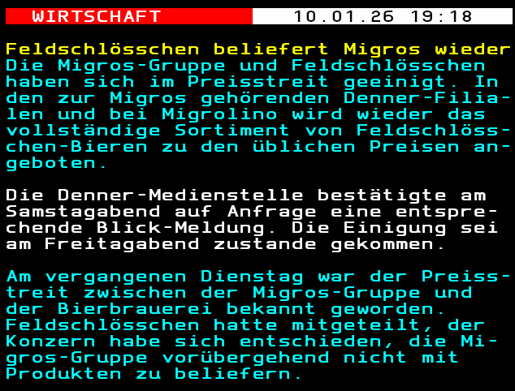
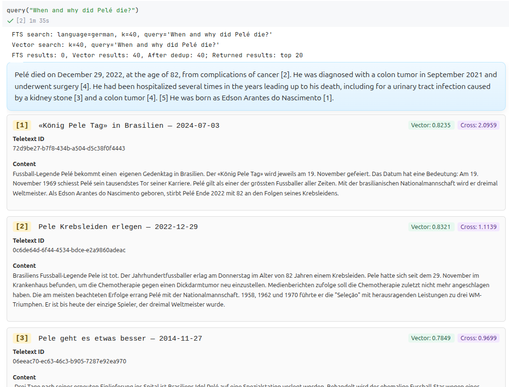
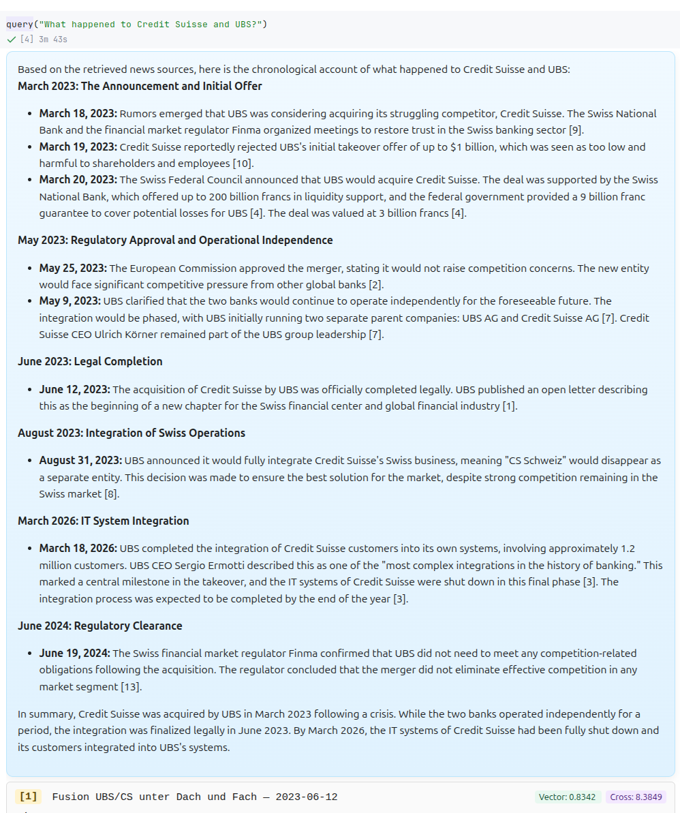
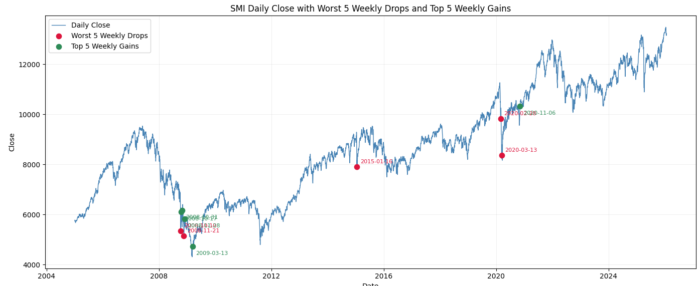

# TeletextSignals — Gemma 4 based local RAG on 25 Years of News

## TL;DR
This repository is a **fully local Retrieval-Augmented Generation (RAG) stack** for querying large document collections—no APIs, no data leaving your machine.

It uses ~25 years of Swiss Teletext news (~500k articles in german language) as a real-world corpus and demonstrates multiple approaches:
- high-recall semantic retrieval: hybrid search (vector + full-text)
- two-step and agentic RAG pipelines

See working examples based on the [Google Deepmind Gemma 4 open model](https://deepmind.google/models/gemma4/):
- [Two-step RAG](B_2step_rag_example.ipynb)
- [Agentic RAG](C_agentic_rag_example.ipynb)

> All processing runs locally. Your documents and queries never leave your device—making this setup viable for sensitive or confidential data.


## Why this exists

Most RAG examples are either:
- toy-scale, or
- dependent on external APIs and hosted vector databases

This project takes a different approach:
- **fully local execution**
- **non-trivial corpus size (~500k documents)**
- **real-world data (news over 25 years)**


It is designed as a **working proof of concept** for:
- building a local RAG pipeline
- prevent hallucinations by providing verifiable sources
- using local LLMs to answer questions


## The dataset: Teletext as structured signal

Swiss news teletext articles in the German language are used as an underlying source. They are downloaded from [teletext.ch](https://www.teletext.ch/SRF1/100).
The archive reaches back 25 years and contains >500k entries, see [0_teletext_key_figures.ipynb](0_teletext_key_figures.ipynb) for details.

Teletext has a useful property:  
it compresses events into **short, high-density summaries**—making it an ideal signal source for retrieval and downstream reasoning.



## Retrieval-Augmented Generation (RAG)

### Document Preparation (Embedding and Vector Store)


Texts are chunked (*Note*: usually the texts are short enough to not require chunking, but
this step makes the workflow extendable for longer documents, e.g. from other sources).

Embedding transforms text into a point in a multidimensional vector space, with the intention
to cluster documents with a similar semantic meaning close together. We need to use a model that
is optimized for a) query retrieval, b) multilingual coverage, and c) works well with news articles.

Postgres with pgvector is used as vector database to efficiently store and query the vector space.

- Embedding Model: [`intfloat/multilingual-e5-large`](https://huggingface.co/intfloat/multilingual-e5-large)
  - Purpose:
      - High-recall semantic retrieval
      - Fine-grained chunk matching
      - RAG-style downstream usage
  - Characteristics:
      - Text is chunked (≈800 characters with overlap)
      - Uses required E5 `query:` / `passage:` prefixes
      - 1024-dimensional vectors
      - Stored in PostgreSQL via [pgvector](https://github.com/pgvector/pgvector)

### Semantic Retrieval


**Bi-encoder retrieval**: starting with a query in natural language, the same embedding model is used to generate the
vector representation of the query and retrieve the closest *k* vectors from the database.

**Full-text search**: for short (e.g. single word) queries, the bi-encoder retrieval will fail (see [A_retrieval_examples.ipynb](A_retrieval_examples.ipynb)
for examples). This is why a full-text search (based on PostgreSQL's `tsvector`) is performed as an additional source for documents.

**Cross-ranking**: to increase the quality of the results, a cross-encoder takes the full query + document full text
and assigns a cross-ranking score. This is repeated for each document retrieved by the bi-encoder retrieval.
The final output is sorted by the cross-ranking score.

- Cross Encoder Model: [`cross-encoder/mmarco-mMiniLMv2-L12-H384-v1`](https://huggingface.co/cross-encoder/mmarco-mMiniLMv2-L12-H384-v1)
  - Input pairs:
    ```
    (query, title + chunk_text)
    ```
  - Produces higher-precision final ordering

> [!NOTE]
> Semantic retrieval is already quite a powerful approach for querying a large document corpus. See the [A_retrieval_examples.ipynb](A_retrieval_examples.ipynb) for examples.
> To use LLMs to specifically answer your queries, there are two approaches available: a) Two-step RAG and b) Agentic RAG


### Two-Step RAG (retrieve → generate)


The query is directly sent to the Semantic Retrieval module (as described above), and the resulting documents are sent as context to an LLM along with the query.
The LLM is instructed to only use the available documents from the context and properly cite the sources in its answer.
This prevents hallucinations and makes the sources tractable.

See [B_2step_rag_example.ipynb](B_2step_rag_example.ipynb) for examples.
[](B_2step_rag_example.ipynb)

- LLM model: [gemma4:e4b](https://ollama.com/library/gemma4:e4b)
  - 4B model with 128K context window
  - Using ollama

### Agentic RAG


Contrary to a two-step RAG, the agentic RAG uses the Semantic Retrieval module as a tool that it autonomously queries.
The exact query is generated by the LLM and if necessary (e.g. if no matching results are generated) can be repeated with a modified query.

See [C_agentic_rag_example.ipynb](C_agentic_rag_example.ipynb) for examples.
[](C_agentic_rag_example.ipynb)

- LLM model: [gemma4:e4b](https://ollama.com/library/gemma4:e4b)
    - Tool aware
    - Using ollama

---

## Requirements

### Hardware
- **GPU:** NVIDIA GPU with ≥ 4 GB VRAM
    - Tested successfully on **Quadro T2000 Max-Q**
- **CPU:** Any modern x86_64 CPU
- **RAM:** ≥ 16 GB recommended
- **Disk:** SSD strongly recommended (vector indexes)

### Notes
- `multilingual-e5-large` is GPU-heavy
- For lower VRAM environments, `multilingual-e5-small` might be an alternative (not tested)

### Software Stack

- Python 3.10+
- PostgreSQL 14+ with `pgvector`
- PyTorch
- Hugging Face Transformers
- Sentence-Transformers
- LangChain (HuggingFaceEmbeddings wrapper)
- See [pyproject.toml](pyproject.toml) for all libraries

### Docker

See [docker-compose.yml](docker-compose.yml)
- Postgres on port 5433
- Ollama on port 11434
- Pull *gemma3:4b-it-qat* and *qwen3.5:4b* once on first run

---

## Scripts and notebooks

### Scripts (`/scripts`)
- `scripts/1_fetch_teletext.py`: Fetch Swiss Teletext articles from the API and upsert them into `docs_teletext`.
- `scripts/2a_embed_articles_E5.py`: Chunk and embed articles with `intfloat/multilingual-e5-large` and store chunk vectors in `emb_teletext_chunk`.

### Notebooks
- `0_teletext_key_figures.ipynb`: Corpus size and summary statistics for the Teletext archive.
- `A_retrieval_examples.ipynb`: Semantic vs. full-text retrieval examples and failure modes.
- `B_2step_rag_example.ipynb`: Two-step RAG pipeline example.
- `C_agentic_rag_example.ipynb`: Agentic RAG workflow example.

---
## Bonus
### [`E_SMI_events.ipynb`](E_SMI_events.ipynb)
Experimental notebook that tries to add context to large market moves, using the SMI as an example by linking the strongest weekly gains and drops to news topics that spike in the same time window.

Technically, it computes weekly SMI returns from Yahoo daily price data, selects the largest positive and negative weeks,
and then queries BERTopic topics built from precomputed `sentence-transformers/paraphrase-multilingual-mpnet-base-v2`
full-article embeddings. Topic clusters are produced with HDBSCAN, and the notebook surfaces the top topics for each week
by comparing topic frequency inside the selected week against prior history with a Gamma-Poisson style posterior probability
filter (`min_probability=0.9`), then shows the matching Teletext articles as qualitative evidence.

This is exploratory only and should be read as timing-based correlation, not causal attribution.

[](E_SMI_events.ipynb)
